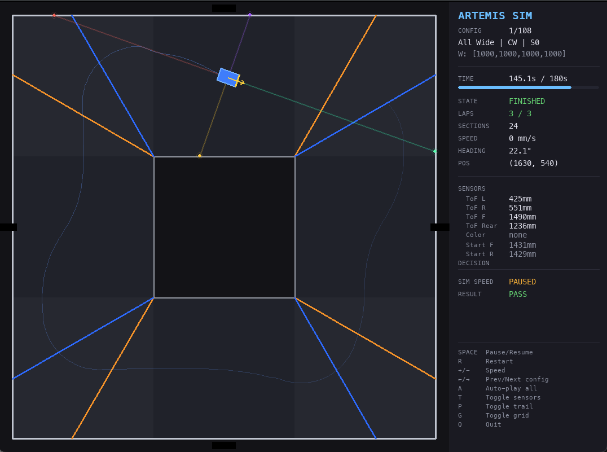

# Control Software — Simulation and Testing

This directory contains the autonomous driving control system simulation for the WRO 2026 Future Engineers Open Challenge.



## Files

### Core Simulation Modules

**config.py**
- Global configuration constants
- PD control gains (KP_WALL, KD_WALL)
- Speed parameters (SPEED_CRUISE, MAX_SPEED)
- Track dimensions and sensor specifications
- Control frequency (CONTROL_HZ = 50 Hz)

**robot.py**
- 2D kinematic robot model
- Sensor simulation:
  - ToF (time-of-flight) distance sensors
  - IMU (accelerometer + gyroscope) heading
  - Color line detection
- Motor command processing (speed, steering)

**track.py**
- Track layout representation
- Straight sections and corner sections
- Wall collision detection
- Color line zones (orange/blue for section detection)
- Track width variation (supports 600mm and 1000mm widths)

**controller.py**
- State machine controller
- PD wall-following algorithm
- Corner turn detection and navigation
- Pillar avoidance logic
- Three-point turn maneuver
- Parking maneuver (obstacle challenge)
- Section/lap counting

### Testing & Visualization

**test_pd_tuning.py**
- Comprehensive test suite with 5 phases:
  1. Straight-line stability (centered placement)
  2. Corner exit recovery
  3. Off-center lateral offset + heading error
  4. Combined offset + angle (real-world tolerance)
  5. Corner entry with non-cardinal heading

- 108 total test configurations covering:
  - 6 track width patterns
  - 2 driving directions (CW/CCW)
  - 4 starting sections
  - ±75/100mm lateral offsets
  - ±5/12° heading errors
  
- Scores tests as PASS/FAIL with points allocation
- Generates detailed failure analysis

**sim_viewer.py**
- Real-time Pygame-based 2D visualizer
- Live simulation rendering at 60 FPS
- Features:
  - Track with walls and color lines
  - Robot with heading indicator
  - Sensor ray visualization
  - Path trail rendering
  - Real-time telemetry panel showing:
    - Position (x, y)
    - Heading (IMU)
    - Speed
    - State machine status
    - Lap/section counting
    - Sensor readings (ToF L/R/F, color detected)
    - Current decision/action
  - Config list for quick navigation (108 test cases)
  - Auto-play mode for batch testing
  - Adjustable simulation speed (1x to 16x)

## Quick Start

### Run Single Test Configuration
```bash
python sim_viewer.py
```
- View real-time simulation with telemetry
- Use L to open config list and jump to any test
- Use A to auto-play all 108 configurations

### Run Full Test Suite
```bash
python test_pd_tuning.py
```
- Executes all 108 test cases headlessly
- Reports pass/fail rate and points per phase
- Shows failure statistics and patterns

## Algorithm Summary

### PD Wall-Following

The core control algorithm uses proportional-derivative (PD) feedback:

```
error = tof_right - tof_left
steering = KP_WALL * error + KD_WALL * (error - prev_error)
```

With adaptive gains based on track width:
- Narrow tracks (≤700mm): Higher gains for stability
- Wide tracks (>900mm): Lower gains to prevent oscillation

### State Machine

1. **STARTING** → Initialize, begin driving
2. **WALL_FOLLOWING** → PD centering and line detection
3. **CORNER_TURN** → Navigate corners with heading correction
4. **PILLAR_AVOIDANCE** → Detect and avoid obstacles
5. **THREE_POINT_TURN** → Execute reversal maneuver
6. **PARKING_APPROACH** → Approach parking zone
7. **PARKING_EXECUTE** → Execute parking maneuver (obstacle)
8. **STOP_SECTION** → Verify starting section via ToF fingerprint
9. **FINISHED** → Complete and stop (open challenge)
10. **STOPPED** → Time limit reached

## Testing Framework

### Configuration Space

Test configurations vary along multiple dimensions:

```
Config = (track_widths, direction, start_section, offset, angle_offset)

track_widths: 6 patterns (all-wide, all-narrow, alternating, etc.)
direction:   CW (1) or CCW (-1)
start_section: 0-3 (each of 4 straight sections)
offset:      -100mm to +100mm (lateral displacement)
angle_offset: -12° to +12° (heading error)
```

### Scoring

- **3 points** — Converged (lateral error < threshold, heading < 5°)
- **2 points** — No collision (partial success)
- **0 points** — Wall collision or timeout


## Dependencies

- Python 3.8+
- pygame 2.0+ (for sim_viewer.py)

---
